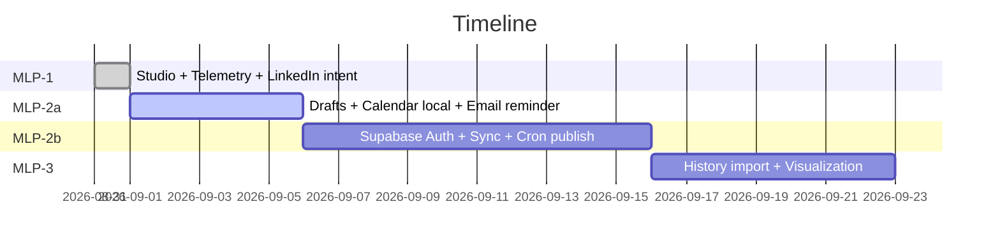

# Content Crafter — MLP Roadmap & Architecture

> Decision: **Supabase** over Firebase (see §5). All chat distilled here so nothing lost.

## 1. Vision
Private, free LinkedIn post studio: `Write → Preview (210-char fold) → Unicode format → Image Card → Copy/Schedule → Post`. No signup for MLP-1, optional Google auth for sync.

## 2. MLP Phases
| Phase | Scope | Auth | Store | Cost | Ship |
|-------|-------|------|-------|------|------|
| **MLP-1 ✅ Shipped** | Editor, Preview, Unicode, Image Card PNG, AiBar (Gemini/Groq/OpenAI BYO key), Telemetry, LinkedIn share intent | None (localStorage) | localStorage | $0 | Now |
| **MLP-2a (next, 3-5d)** | Drafts + Calendar + Email reminder (no auto-publish). States: draft/scheduled/posted, calendar dots, counters | Optional (local only) | localStorage + `/api/remind` | $0 | Next |
| **MLP-2b (if 2a traction)** | Cross-device sync, true scheduled publish via cron, Google Sign-In | Google OAuth | Supabase Postgres | $0 free tier | 2-3w |
| **MLP-3** | Analytics: 3-month LinkedIn history via CSV import → frequency chart + `what-if` projection, AI history per draft | Google | Supabase + Proxycurl optional $2/200 | ~$0-2 | Later |

## 3. Requirements (comprehensive)

### Functional
- RF1 Draft CRUD: create, edit, duplicate, delete, search. Fields: `id, user_id?, content, content_unicode, status, scheduledAt, postedAt, ai_meta[], gradient, cardTitle`
- RF2 Calendar: month/week view, dots per scheduled, click → open draft, drag to reschedule
- RF3 Schedule: pick date+time, save `scheduledAt`. Local: email/browser reminder at T-5min. Cloud: cron posts via LinkedIn API
- RF4 Sync: anonymous → localStorage; signed-in → Supabase `drafts` table + RLS per user
- RF5 Telemetry: `copy_preview, copy_caption, emoji_click, ai_click/success/error, export_png, linkedin_share, draft_save, schedule_save`. DNT respected, no PII
- RF6 LinkedIn: share intent fallback always; API publish only if `LINKEDIN_CLIENT_ID/SECRET` + token. History import: CSV upload → `linkedin_posts` table
- RF7 Visualization: 3-month frequency bar + engagement line, `projected if 3×/week with Crafter` dashed line

### Non-Functional
- Free tier only, no vendor lock-in, RLS, GDPR delete, <100ms draft save, 99% client-side

## 4. Architecture & Data Model

```mermaid
graph TD
  A[Browser React Vite] -->|localStorage anon| B[local drafts]
  A -->|Google OAuth| C[Supabase Auth]
  C --> D[Supabase Postgres]
  D --> T1[drafts]
  D --> T2[linkedin_posts]
  D --> T3[events telemetry]
  A -->|track sendBeacon| E[/api/telemetry]
  E --> T3
  A -->|schedule| F[/api/remind or /api/linkedin/schedule]
  F -->|cron| G[Resend Email]
  F -->|cron| H[LinkedIn API ugcPosts]
  A -->|CSV upload| T2
  T2 --> I[Chart - Recharts]
  T1 --> I
```



### Supabase Tables (SQL)
```sql
create table drafts (
  id uuid primary key default gen_random_uuid(),
  user_id uuid references auth.users,
  content text not null,
  status text check (status in ('draft','scheduled','posted')),
  scheduled_at timestamptz,
  posted_at timestamptz,
  ai_meta jsonb,
  created_at timestamptz default now()
);
alter table drafts enable row level security;
create policy "own drafts" on drafts for all using (auth.uid()=user_id);

create table events (
  id bigserial primary key,
  user_id uuid,
  event text,
  props jsonb,
  created_at timestamptz default now()
);
```

## 5. Firebase vs Supabase Decision — **Supabase wins**
| Criteria | Firebase | Supabase | Verdict |
|----------|----------|----------|---------|
| Free tier | 50k reads/d, 1GB, Functions 2M | 500MB DB, 50k MAU, 2GB bandwidth, Edge Functions 500k | Supabase more generous for drafts |
| Auth Google | Yes, easy | Yes, same + magic link | Tie |
| DB | NoSQL Firestore (denormalize) | Postgres (SQL, RLS, relations) | Supabase better for `drafts ↔ analytics` |
| Cron/Schedule | Cloud Scheduler $ | pg_cron + Vercel Cron free | Supabase |
| Open source/lock-in | GCP lock | OSS, self-hostable | Supabase |
| DX for Vite | SDK fine | `supabase-js` + `supabase auth` trivial | Tie |
**Call: Supabase.** Keep Firebase as backup if you hit Supabase limits.

## 6. Setup Guide (Supabase, 5 min)
1. `https://supabase.com` → New Project (free) → copy `VITE_SUPABASE_URL`, `VITE_SUPABASE_ANON_KEY`, `SUPABASE_SERVICE_ROLE_KEY`
2. In Supabase Dashboard → SQL Editor → paste table SQL above → Run
3. Auth → Providers → Enable Google → paste `VITE_GOOGLE_CLIENT_ID` (reuse) + generate secret
4. In Vercel/Netlify env: `VITE_SUPABASE_URL`, `VITE_SUPABASE_ANON_KEY`, `VITE_LINKEDIN_CLIENT_ID`, `LINKEDIN_CLIENT_SECRET`, `RESEND_API_KEY` (for email reminders, free 100/d)
5. Add `src/lib/supabase.ts`:
```ts
import { createClient } from '@supabase/supabase-js'
export const supabase = createClient(import.meta.env.VITE_SUPABASE_URL!, import.meta.env.VITE_SUPABASE_ANON_KEY!)
```
6. Deploy: `vercel --prod` (cron in `vercel.json`: `{ "crons": [{ "path": "/api/linkedin/schedule", "schedule": "*/5 * * * *" }] }`)

## 7. Telemetry Metrics Dashboard (already instrumented)
Events: `copy_*, emoji_*, ai_*, export_*, linkedin_*, draft_*, schedule_*`. Query:
```sql
select event, count(*) from events where created_at > now()-interval '7 days' group by event;
select date_trunc('day', created_at) as day, count(*) from events where event='linkedin_share_intent' group by day;
```

## 8. Next Action
Implement MLP-2a local drafts+calendar first, publish roadmap image on LinkedIn, collect waitlist for MLP-2b sync. No data lost — this doc is source of truth.
